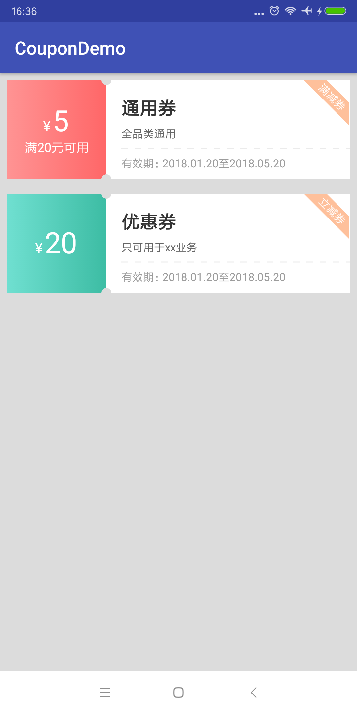

# Screenshot



# Usage

高度是根据宽按一定比例自适应的，所以layout_height只需要wrap_content就行了，指定任何值都会忽略；左边的渐变颜色是从左向右渐变；其他没啥，就是一些动态计算，直接在xml里面配置：

````
<cn.shiguiyou.coupon.CouponView
        android:layout_width="match_parent"
        android:layout_height="wrap_content"
        app:bevelText="满减券"
        app:discount="5"
        app:leftCondition="满20元可用" />

<cn.shiguiyou.coupon.CouponView
        android:layout_width="match_parent"
        android:layout_height="wrap_content"
        android:layout_marginTop="16dp"
        app:bevelText="立减券"
        app:discount="20"
        app:gradientFrom="#6fdfd0"
        app:gradientTo="#3cbca3"
        app:mainTitle="优惠券"
        app:subTitle="只可用于xx业务" />
````

更详细的修改直接修改源码，参数都可以直接修改。